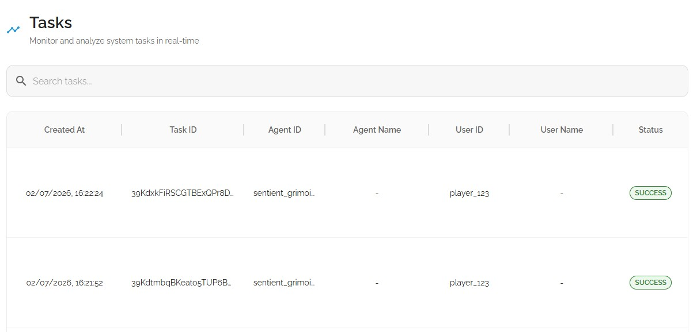
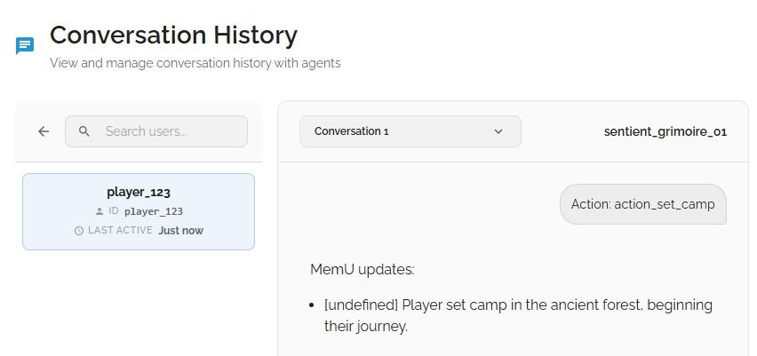
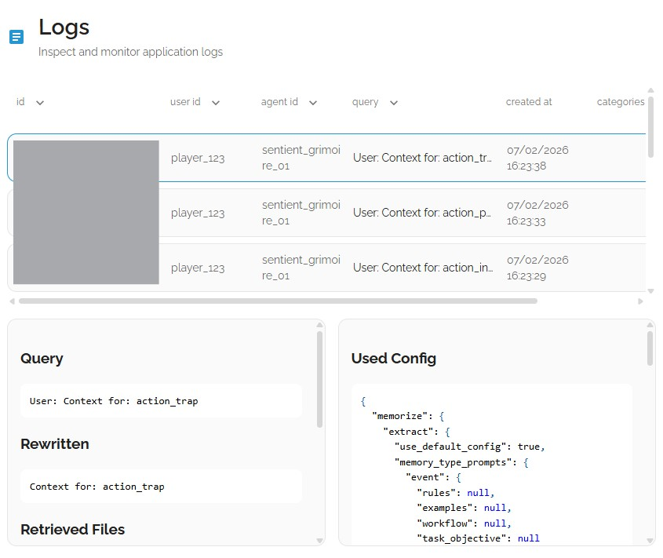

# 📖 Chronicle: The Sentient Grimoire

### 日本語紹介 (Introduction)
「センチエント・グリモワール」へようこそ。これは、人工知能が紡ぐ物語に「永遠の記憶」を与える革新的なRPGエンジンです。従来のAIゲームとは異なり、プレイヤーのあらゆる選択は忘れ去られることなく、memUの記憶層に深く刻まれます。あなたの行動が、世界の運命を永続的に変えていく。これは、生きた古文書との対話です。


---

## 🌟 Project Overview
**"A persistent AI-driven RPG where every player choice is etched into a sentient memory layer that shapes the world's future."**

Chronicle is a dark-fantasy narrative engine that transforms the standard LLM chat experience into a living, breathing world. By bridging **OpenAI's GPT-4o** with **memU's cognitive memory API**, we’ve created a "Sentient Grimoire" that remembers your past triumphs, betrayals, and even the smallest details of your journey.

## ⚠️ Problem Being Solved
**"Traditional AI games suffer from 'context amnesia,' where the story loses its depth as the session grows; we solve this by providing a persistent, long-term cognitive memory."**

In most AI adventures, once the conversation window fills up, the AI begins to forget earlier plot points. Chronicle solves this by externalizing the game's state and player history into a structured memory layer, allowing for consistent narrative arcs that can span hours or even days of gameplay.


## ✨ Key Features
- **Cognitive Persistence:** Powered by **memU**, the game maintains a virtual file system (stats, inventory, world history) that persists across sessions.
- **Dynamic Narrative Engine:** Uses a "Sentient Grimoire" persona that adapts its tone based on your alignment (Heroic vs. Ruthless).
- **Infinite Consequences:** Every action triggers a `memu_update`, ensuring that an NPC you offend in Chapter 1 will remember your face in Chapter 10.
- **Gothic UI:** A custom-built interface designed to look like ancient parchment, providing an immersive tabletop experience.

## 🛠 Tech Stack
- **Framework:** [Next.js](https://nextjs.org/) (App Router)
- **Intelligence:** [OpenAI API](https://openai.com/) (GPT-4o-mini)
- **Memory:** [memU API](https://memu.so/) (Long-term context & retrieval)
- **Styling:** Tailwind CSS + Lucide Icons

## 🚀 Getting Started

### Prerequisites
- Node.js 18+
- OpenAI API Key
- memU API Key

### Installation
1. Clone the repository:
   ```bash
   git clone https://github.com/your-username/chronicle-rpg.git
2. Install dependencies:
   ```bash
   npm install
3. Create a .env file in the root directory:
   ```bash
   OPENAI_API_KEY=your_openai_key
   OPENAI_MODEL=gpt-4o-mini
   MEMU_API_KEY=your_memu_key
   MEMU_API_URL=https://api.memu.so
   ```
4. Run the development server:
   ```bash
   npm run dev

## 🏗 Architecture
The project follows a "Cognitive Loop" structure:
1. User Action: Player clicks a choice button.
2. Context Retrieval: The system queries memU for relevant history.
3. LLM Inference: GPT-4o generates the next narrative beat based on the memory.
4. Memory Inscription: The LLM issues updates back to memU to save the new state.

## 🧠 How memU is Used
We treat memU as the game's "Soul." Instead of just storing chat logs, we use it to maintain the **World State** and **Character Relationships**.
- **World State:** We store key facts like "Player is in the Forbidden Forest" or "The Dragon is awake."
- **Relationships:** We track how NPCs feel about the player (e.g., "Guard distrusts the player").
- **Retrieval:** Before generating each scene, we ask memU: *"What does the player need to remember right now?"*

## 🖥️ MemU Interface & Persistence Proof
To validate the Sentient Grimoire's ability to remember and evolve, we utilize the memU dashboard as our cognitive monitoring tool. Below are the technical logs demonstrating the successful integration of long-term memory.

### 🧠 Agent & Task Management
Once a player starts their journey, a unique agent (sentient_grimoire_01) is initialized. Every narrative beat and player decision is submitted as a Memorization Task, ensuring that the context is processed and indexed for future retrieval.

Figure 1: The memU dashboard showing the active Sentient Grimoire agent and successful task processing.



### 📚 Memory Inscription (The "Living" Database)
Instead of simple text storage, memU extracts "Souvenirs" (Memories). Each screenshot below represents a moment where the AI analyzed the player's action—such as choosing a character class or making a moral decision—and stored it with high-dimensional vectors for semantic search.

Figure 2: Real-time logs of the player's history being etched into the cognitive layer.



### 🔍 Contextual Retrieval in Action
When the player encounters a new event, the system performs a Semantic Retrieval. This allows the Grimoire to "recall" specific past interactions, even if they happened hundreds of turns ago, solving the "Context Amnesia" common in standard LLM applications.

Technical Note: Each retrieval query is weighted based on the current narrative state, ensuring the most relevant memories are prioritized for the next story beat.

Figure 3: Detailed view of retrieved memory items being injected back into the LLM prompt.


---
Created for the memU x Trae Hackathon 2026.